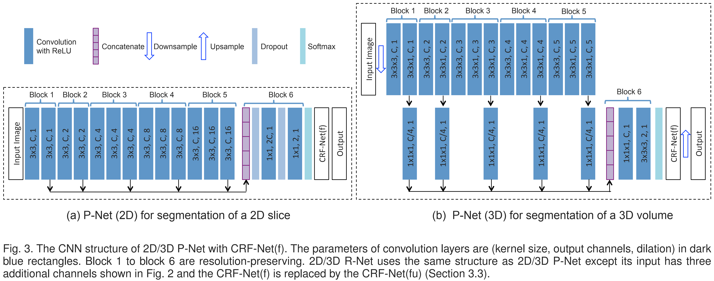
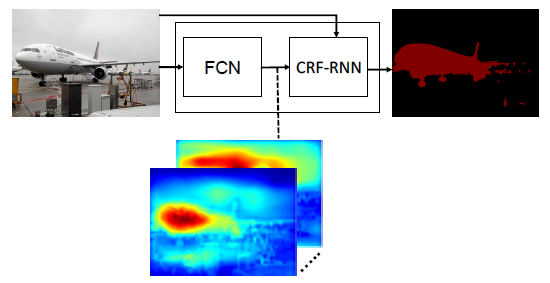
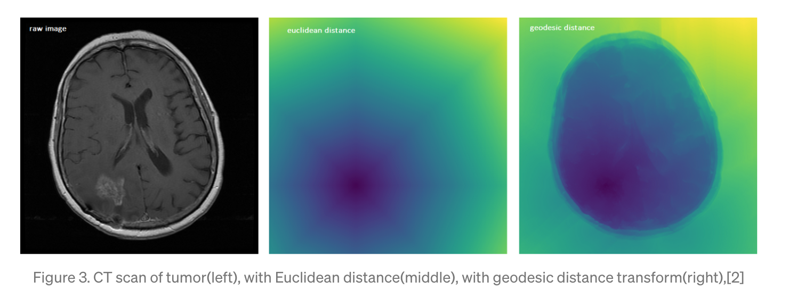
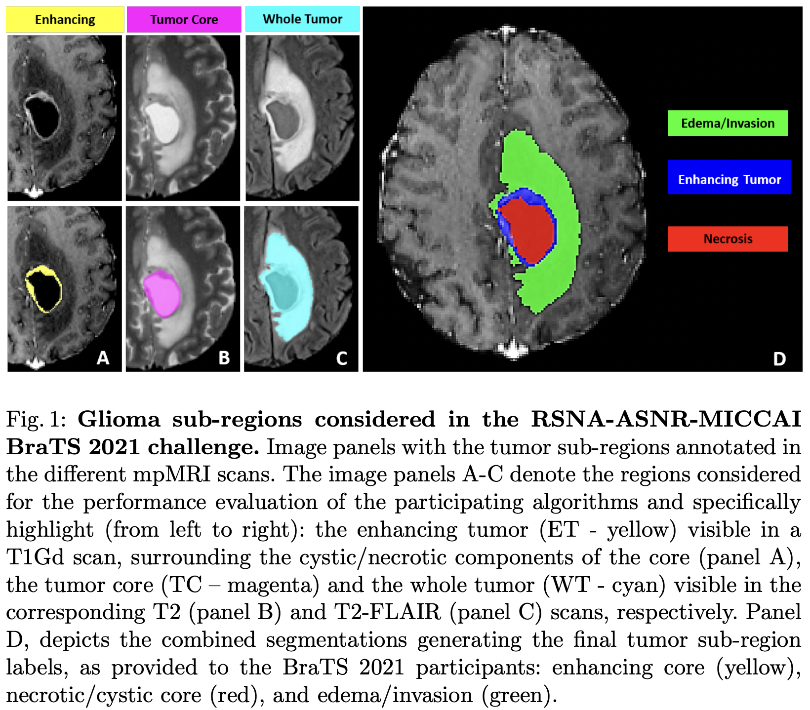

# :brain: DeepIGeoS
DeepIGeoS Paper Implementation
> :page_facing_up: [DeepIGeoS: A Deep Interactive Geodesic Framework for Medical Image Segmentation (2018)](https://ieeexplore.ieee.org/abstract/document/8370732)

## :pushpin: Prerequisites
Please check environments and requirements before you start. If you need them, you should either upgrade versions or install them.


### ☺︎ Environments
`Ubuntu 16.04`  
`Python 3.7.11`

### ☺︎ Requirements
```
dotmap
GeodisTK
opencv-python
tensorboard
torch
torchio
torchvision
tqdm
PyQt5
```

## :pushpin: Datasets
Download BraTS 2021 dataset using `load_datasets.sh`.  
```
$ bash load_datasets.sh
```

## :pushpin: Train

### ☺︎ P-Net
```
$ python train_pnet.py -c configs/config_pnet.json
```

### ☺︎ R-Net
```
$ python train_rnet.py -c configs/config_rnet.json
```

### ☺︎ Tensorboard
```
$ tensorboard --logdir experiments/logs/
```

## :pushpin: Run

### ☺︎ Simple QT Application
We created an application that operates DeepIGeoS with mouse click interaction. Run DeepIGeoS as shown below.
```
$ python main_deepigeos.py
```

## :pushpin: Results

### ☺︎ With Simulated Interactions
Result with simulated user interactions according to the following rules. Simulations were generated on three slices with the largest mis-segments in each axes: sagittal, coronal and axial.
1. P-Net automatic segmentation result is compared with the ground truth to find mis-segmented regions.
2. Then the user interactions on each mis-segmented region are simulated by randomly sampling n pixels in that region. (Suppose the size of one connected under-segmented or over-segmentedregion is Nm, we set n for that region to 0 if Nm < 30 and [Nm/100] otherwise)

<div>
  
  
  
</div>

- Yellow border: Ground Truth Mask
- Green area: P-Net Prediction Mask
- Red area: R-Net Refinement Mask

### ☺︎ With User Interaction
Result with user interactions from mouse clicks.

(데모 영상 녹화 후 추가예정)

## :pushpin: Background of DeepIGeoS
To perform DeepIGeoS, we have studied and understood the original paper. 

### ☺︎ Abstract
- A deep CNN-based interactive framework for 2D and 3D medical image segmentation
- Present a new way to combine user interactions with CNNs based on geodesic distance maps
- Propose a resolution-preserving CNN structure which leads to a more detailed segmentation result compared with traditional CNNs with resolution loss
- Extend the current RNN-based CRFs for segmentation so that the back-propagatable CRFs can use user interactions as hard constraints and all the parameters of potential functions can be trained in an end-to-end way.

### ☺︎ Architecture

<div>
  
  <p><i><a href="https://arxiv.org/abs/1707.00652" target="_blank" rel="noopener noreferrer">https://arxiv.org/abs/1707.00652</a></i></p>
</div>

Two stage pipeline : P-Net(obtains automatically initial segmentation) + R-Net(refines initial segmentation w/ small # of user interactions that we encode as geodesic distance maps)
- P-Net : use CNN to obtain an **initial automatic segmentation**
- R-Net: refine the segmentation by taking as input **the original image, the initial segmentation and geodesic distance maps** based on foreground/background user interactions.


### ☺︎ CRF-Net

<div>
  
  <p><i><a href="https://arxiv.org/abs/1502.03240" target="_blank" rel="noopener noreferrer">https://arxiv.org/abs/1502.03240</a></i></p>
</div>

The CRF-Net(f) is connected to P-Net and the CRF-Net(fu) is connected to R-Net.
- CRF-Net(f): extend [CRF based on RNN](https://arxiv.org/abs/1502.03240) so that the pairwise potentials can be freeform functions.
- CRF-Net(fu): integrate user interactions in our CRF-Net(f) in the interactive refinement context.
- **But here CRF-Nets are not implemented for simplicity**

### ☺︎ Geodesic Distance Maps

<div>
  
  <p><i><a href="https://towardsdatascience.com/preserving-geodesic-distance-for-non-linear-datasets-isomap-d24a1a1908b2" target="_blank" rel="noopener noreferrer">https://towardsdatascience.com/preserving-geodesic-distance-for-non-linear-datasets-isomap-d24a1a1908b2</a></i></p>
</div>

The interactions with the same label are converted into a distance map.
- The euclidean distance treats each direction equally and does not take the image context into account.
- In contrast, the geodesic distance helps to better differentiate neighboring pixels with different appearances, and improves label consistency in homogeneous regions. 
 

### ☺︎ BraTS Dataset

<div>
  
  <p><i><a href="https://arxiv.org/pdf/2107.02314.pdf" target="_blank" rel="noopener noreferrer">https://arxiv.org/pdf/2107.02314.pdf</a></i></p>
</div>

We only use T2-FLAIR(panel C) images in the [BraTS 2021](https://arxiv.org/pdf/2107.02314.pdf) and only segment the whole tumor.
- The BraTS dataset describes a retrospective collection of brain tumor mpMRI scans acquired from multiple different institutions under standard clinical conditions, but with different equipment and imaging protocols, resulting in a vastly heterogeneous image quality reflecting diverse clinical practice across different institutions. Inclusion criteria comprised pathologically confirmed diagnosis and available MGMT promoter methylation status. These data have been updated, since BraTS 2020, increasing the total number of cases from 660 to 2,000.
